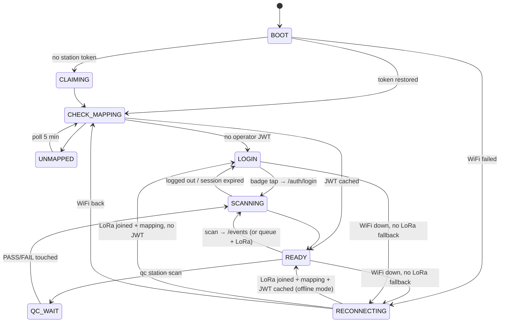

# ARCHITECTURE.md

## Blocks

```mermaid
flowchart LR
    subgraph station[RMG RFID station]
        RFID[RFID reader<br/>MFRC522 SPI (esp32dev)<br/>UART ASCII (rak3212)] --> SM[State machine<br/>main.cpp]
        TOUCH[FT6336 touch<br/>I2C] --> SM
        SM --> LCD[ILI9341 display<br/>TFT_eSPI]
        SM --> LED[LED + buzzer]
        SM --> API[api_client<br/>HTTP/JSON]
        SM --> Q[(NVS event queue)]
        Q --> API
        SM -. rak3212 only .-> LORA[lora_link task<br/>RadioLib / SX1262]
        CON[serial console<br/>USB CDC] -. rak3212 only .-> SM
    end
    API --> ETS[ETS backend]
    LORA --> GW[LoRaWAN gateway] --> CS[ChirpStack v4] -. integration (backend repo) .-> ETS
```

## State machine



Offline mode (rak3212 with a joined link): READY keeps scanning; HTTP heartbeat, mapping poll
and queue flush are gated on `online`; scans go straight to the NVS queue plus a LoRa copy; WiFi
is retried every 5 s; when it returns the queue is flushed. Identity (token, JWT, mapping) is
restored from NVS before the WiFi attempt, so a no-WiFi boot can use it.

## Event identity and de-duplication

`event_id = "E_<epoch>_<seq>"`, `seq` from `storageNextSeq()` (u16, NVS checkpoint every 64, +64
at boot). The LoRa fPort-10 frame carries the same `(epoch, seq)`; station identity is the
DevEUI (= MAC with `FF FE`) which equals the claim MAC. Contract: `LORAWAN_PAYLOAD.md`.

## Modules

| Module | Role | Board |
|---|---|---|
| `main.cpp` | state machine, POST, hooks | both |
| `api_client` | claim / me / heartbeat / login / events over HTTP | both |
| `event_queue` | 50-entry NVS ring for HTTP replay | both |
| `storage` | token, JWT, mapping, seq | both |
| `display`, `touch`, `led_buzzer`, `ntp_sync`, `wifi_manager`, `ota` | peripherals and services | both (pins per board) |
| `rfid_mfrc522` | MFRC522 over SPI | esp32dev |
| `rfid_frame` (pure) + `rfid_uart` | ASCII/binary frame parser + UART1 backend | rak3212 |
| `lora_payload` (pure) + `lora_link` | schema-1 encoders + RadioLib task (core 0, queue, NVS session) | rak3212 |
| `serial_console` | bench console over USB CDC | rak3212 |
| `boards/board_<env>.h` | pins + capability flags | per board |

## Threads and buses (rak3212)

- Core 1: Arduino `loop()` — state machine, display (SPI3/HSPI via TFT_eSPI), touch (Wire),
  reader UART1, console, OTA. No blocking radio calls.
- Core 0: `lora` FreeRTOS task — RadioLib on the global `SPI` (SPI2), NVS `lorawan`. Commands
  arrive through a 16-entry queue; status is copied under a spinlock.
- WiFi runs in its own IDF tasks. The SX1262 and the WiFi radio are independent.

## Resource budgets

See `../CLAUDE.md` §6: rak3212 16.4 % flash / 16.6 % RAM; esp32dev 82.7 % of its 1.25 MB OTA
slot (pre-existing exception), ≤ 2 KB growth allowed per feature; loop gap < 50 ms; LoRa task
stack high-water reported by `lora show`.
